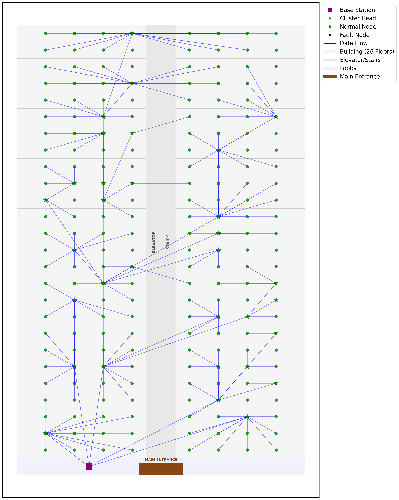
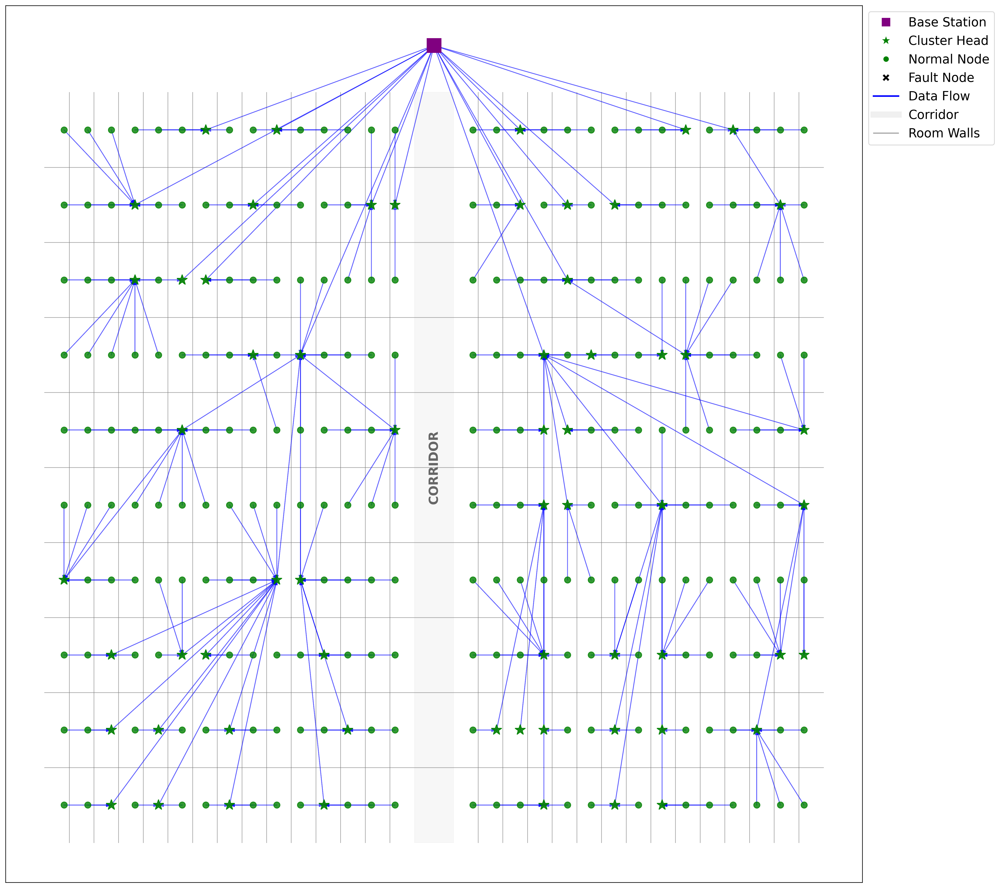

# Maintenance Strategy Recommendation for Wireless Sensor Networks

## Project Background

Wireless Sensor Networks (WSNs) are widely deployed in resource-constrained environments for long-term monitoring and large-scale data collection.   Maintainability is particularly critical in WSNs because they are prone to faults and the cost of post-failure maintenance is often prohibitively high.  However, few studies have provided systematic maintenance strategy at the design stage of WSNs.  In this work, we propose a WSNs maintenance strategy recommendation framework that systematically guides the selection of maintenance methods and the configuration of fault inspection intervals.  To implement this framework, the recommendation task is modeled as a joint optimization problem that minimizes the total cost under budget constraints.  An enhanced Genetic Algorithm (GA) is proposed to solve this joint optimization problem.  The proposed framework is validated in two WSNs scenarios, smart meter reading and animal room monitoring, demonstrating its effectiveness for WSNs maintenance strategy recommendation.   The proposed enhanced GA was compared with GA, Particle Swarm Optimization (PSO), and Simulated Annealing (SA).  In the smart meter scenario, it reduced optimization time by 28%, 52%, and 52%.  For animal monitoring, the time reductions were 34%, 53%, and 54%, respectively.

## Scenarios

### Scenario 1: Smart Meter Network

**Scenario Description:**
In the smart meter reading scenario, the dataset specifies $208$ sensor nodes deployed in a multi-floor residential building. 
This scenario focuses on automatic meter reading in a modern multi-story residential building. As illustrated in Fig. 1, a total of $208$ smart meter nodes are deployed across $27$ floors. Each node periodically collects and reports electricity consumption data. The scenario is characterized by sparse node distribution, low-frequency data collection, long system lifetime requirements, and relatively low-value individual data packets. 

**Topology Structure:**  


### Scenario 2: Animal House Monitoring

**Scenario Description:**
This scenario involves environmental monitoring in an animal research facility, such as one housing laboratory mice. As shown in Fig.2, $300$ sensor nodes are deployed across multiple animal rooms to monitor environmental conditions such as temperature and humidity. Given the high value of the animals and the potential economic loss if environmental parameters deviate, including a temperature spike that could cause animal mortality, this scenario features denser node deployment, higher sampling frequency, and higher-value data packets. 

**Topology Structure:**  


# Usage
If you need to run this project for recommending maintenance strategy of WSNs, then only need to configure [runtime environment](#runtime-environment)。


# Environment Configuration
## runtime environment
- Python 3.8+
- Required packages: numpy, matplotlib, scipy

# Directory Structure Description
```sh
|-- README.md            // Help
|-- images               // Topology
|-- display              // Visualization
|-- utilities.py         // Maintenance modules and the fault model 
|-- scene_generator.py   // Scene Generator (Smart Meter Network and Animal House Monitoring)
|-- calculate_cost.py    // Calculate the cost and expenses
|-- module_cost.py       // Calculate the cost and expenses of maintenance module
|-- simulator.py         // WSN simulation
|-- enhanced_genetic.py  // Enhanced Genetic Algorithm
|-- genetic.py           // Genetic Algorithm
|-- particle_swarm.py    // Particle Swarm Optimization Algorithm
|-- simulated_annealing.py     // Simulated Annealing Algorithm
|-- evaluation.py            // Evaluation of maintenance strategies
```


